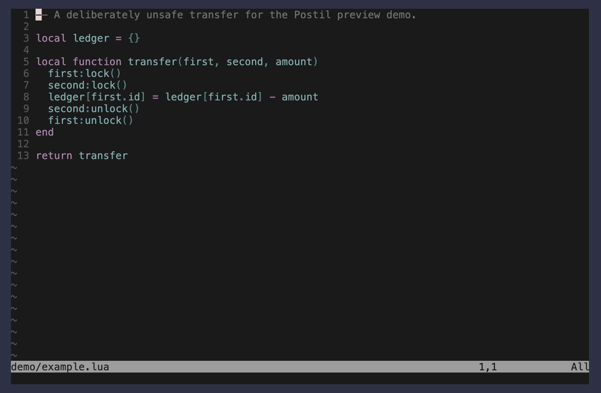

<div align="center">

# postil.nvim

**Send a Neovim visual selection, its source location, and an instruction to an interactive command running in a tmux pane.**

<a href="https://github.com/koutaroyumiba/postil.nvim/releases/latest"></a>


<a href="LICENSE"></a>

</div>

> **Status:** pre-release. See [CHANGELOG.md](CHANGELOG.md) for the planned v1 scope.

## Overview

The primary workflow is:

1. Select source text in Visual mode.
2. Invoke `PostilSend` through a user keymap.
3. Write a single- or multiline instruction in an editable floating buffer.
4. Use `:w` to submit the instruction or `:q!` to cancel.
5. Reuse the configured tmux pane, or create one automatically.
6. Paste the complete formatted message as one bracketed multiline prompt.

`PostilPreview` follows the same selection and instruction flow, then opens the formatted message in a read-only floating window without contacting tmux.

<div align="center">
  
</div>

## Features

- Exact characterwise, linewise, and blockwise visual selections
- Source path, line range, filetype, and project-root context
- Editable multiline instructions using normal Neovim motions
- Safe variable-length Markdown code fences
- Previewing without tmux or a destination process
- Existing tmux pane selection by stable pane ID
- Automatic detached pane creation and reuse
- Automatic recovery when the remembered pane is closed
- Bracketed multiline paste through a uniquely named tmux buffer
- Optional automatic Enter submission
- Custom message formatting
- No third-party Lua dependencies and no default keymaps

## Requirements

- Neovim 0.12 or newer
- macOS or Linux
- `tmux` available on `PATH`
- Neovim running inside tmux for sending
- A destination command that accepts multiline terminal paste

Previewing works outside tmux.

## Installation

### lazy.nvim

```lua
{
  "koutaroyumiba/postil.nvim",
  config = function()
    local postil = require("postil")

    postil.setup({
      command = "pi",
    })

    vim.keymap.set("x", "<leader>as", function()
      postil.send_visual()
    end, { desc = "Send selection with Postil" })

    vim.keymap.set("x", "<leader>aP", function()
      postil.preview_visual()
    end, { desc = "Preview selection with Postil" })
  end,
}
```

For local development:

```lua
{
  dir = vim.fn.expand("~/dev/personal/postil.nvim"),
  name = "postil.nvim",
  config = function()
    require("postil").setup()
  end,
}
```

Postil deliberately installs no default keymaps.

## Configuration

The defaults are:

```lua
require("postil").setup({
  command = "pi",
  split = {
    direction = "right",
    size = 40,
  },
  submit = true,
  startup_delay = 500,
  prompt = "Postil: ",
  root_markers = { ".git" },
  format = nil,
})
```

| Option | Description |
| --- | --- |
| `command` | Non-empty command string started in newly created panes. Arguments are allowed, for example `"pi --model example"`. Existing panes are never restarted. |
| `split.direction` | One of `"right"`, `"left"`, `"above"`, or `"below"`. |
| `split.size` | Positive integer in columns for left/right splits or rows for above/below splits. |
| `submit` | When `true`, send one final Enter after the complete message is pasted. |
| `startup_delay` | Non-negative delay in milliseconds before sending to a newly created pane. |
| `prompt` | Title of the editable instruction window. |
| `root_markers` | Non-empty marker list passed to `vim.fs.root()`. The current working directory is the fallback. |
| `format` | Optional function that receives the formatter context and returns the complete message string. |

Unknown keys and invalid values raise an error during `setup()`. Repeated calls replace the previous configuration with a fresh merge over the defaults.

## Usage

### Send a selection

Select text in Visual mode and call:

```lua
require("postil").send_visual()
```

The instruction window is a normal editable Neovim buffer:

- `:w` submits the instruction and closes the editor.
- `:q!` cancels without sending.
- Writing an empty or whitespace-only instruction cancels quietly.

To paste without the final Enter for one invocation:

```lua
require("postil").send_visual({ submit = false })
```

`:PostilSend!` inverts the configured `submit` value for that invocation.

### Preview a selection

```lua
require("postil").preview_visual()
```

The preview uses the configured formatter but does not inspect, create, or contact a tmux pane. Close the read-only preview with `q` or `<Esc>`.

### Select a target

```vim
:PostilTarget
```

This lists every pane in the current tmux session. Postil rejects the pane containing Neovim to avoid pasting into the editor itself.

A stable pane ID may be selected directly:

```vim
:PostilTarget %7
```

The selected pane is remembered only for the current Neovim process.

## Target lifecycle

When sending, Postil:

1. Reuses the remembered pane if it is still live.
2. Clears a stale target if its pane disappeared.
3. Creates a detached pane using the configured split.
4. Starts `command` in the selected file's project root.
5. Waits `startup_delay` only for a newly created pane.
6. Loads the complete message into a uniquely named tmux buffer.
7. Uses bracketed paste while preserving linefeeds.
8. Optionally sends one final Enter.

Creating a target never moves tmux focus away from Neovim.

## Default message

````text
File: lua/example.lua
Lines: 12-19
Filetype: lua

```lua
selected source text
```

Instruction: Explain why this can deadlock
````

Single-line selections use `Line: N`. Empty filetypes omit both the `Filetype:` line and code-fence language. Fence length automatically increases when the selected text contains backticks.

## Custom formatter

```lua
require("postil").setup({
  format = function(context)
    return table.concat({
      "Review " .. context.relative_path,
      string.format("Lines %d-%d", context.start_line, context.end_line),
      "",
      context.text,
      "",
      context.instruction,
    }, "\n")
  end,
})
```

The context contains:

```lua
{
  instruction = "Explain why this can deadlock",
  text = "selected source text",
  path = "/absolute/path/to/file.lua",
  relative_path = "lua/example.lua",
  start_line = 12,
  end_line = 19,
  filetype = "lua",
  root = "/absolute/path/to/project",
  selection_type = "character", -- "character", "line", or "block"
}
```

The formatter must return a string. Formatter errors are reported without including selected source or instruction content.

## Commands

| Command | Behavior |
| --- | --- |
| `:PostilSend[!]` | Send the latest visual selection. `!` inverts automatic submission. |
| `:PostilPreview` | Preview the formatted selection without contacting tmux. |
| `:PostilTarget [pane-id]` | Select a pane interactively or by stable pane ID. |
| `:PostilNew` | Create and remember a fresh pane without closing the previous target. |
| `:PostilClearTarget` | Forget the target without killing its pane. |
| `:PostilStatus` | Show the target, liveness, command, and project root. |

## Lua API

```lua
require("postil").setup(opts)
require("postil").send_visual(opts)
require("postil").preview_visual()
require("postil").select_target()
require("postil").new_target()
require("postil").clear_target()
require("postil").status()
```

Public calls return `true` when synchronous work completes or an asynchronous UI/send workflow starts. Synchronous failures return `nil, error_message`. User cancellation is quiet.

## Troubleshooting

### Postil says Neovim must be running inside tmux

Sending is intentionally tmux-only. Start tmux, then launch Neovim inside that session. `PostilPreview` remains available outside tmux.

### The destination pane closes immediately

Check that `command` exists and runs successfully from a shell. Postil does not detect destination-specific startup failures or wait for a readiness signal beyond `startup_delay`.

### The first send arrives before the destination is ready

Increase the delay:

```lua
require("postil").setup({
  startup_delay = 1000,
})
```

### The message is split into multiple prompts

The destination must request terminal bracketed-paste mode. Postil uses `tmux paste-buffer -p -r` to send one multiline paste and preserves linefeeds, but it cannot add bracketed-paste support to the destination program.

### Postil reports that it is busy

Only one send operation may be active. Finish or cancel the open instruction editor, or wait for the current paste to complete.

### The wrong pane is selected

Inspect the current target with `:PostilStatus`, choose another with `:PostilTarget`, or forget it with `:PostilClearTarget`.

## Security and data handling

Selection text and instructions are passed to tmux over stdin. Postil does not interpolate them into shell commands, write them to disk, use the system clipboard, persist pane IDs, or send data over the network. The configured destination command controls its own network behavior.

## v1 limitations

- tmux is the only send transport.
- Pane targets are not persisted across Neovim restarts.
- Only one target and one pending send are supported.
- Responses are not captured or rendered in Neovim.
- Postil does not manage destination-specific sessions or readiness.
- No default keymaps are installed.

## Development

Run the headless checks with:

```sh
nvim --headless -u tests/minimal.lua
```

Regenerate the preview GIF on a configured development machine with:

```sh
vhs demo/preview.tape
```

## License

[MIT](LICENSE)
